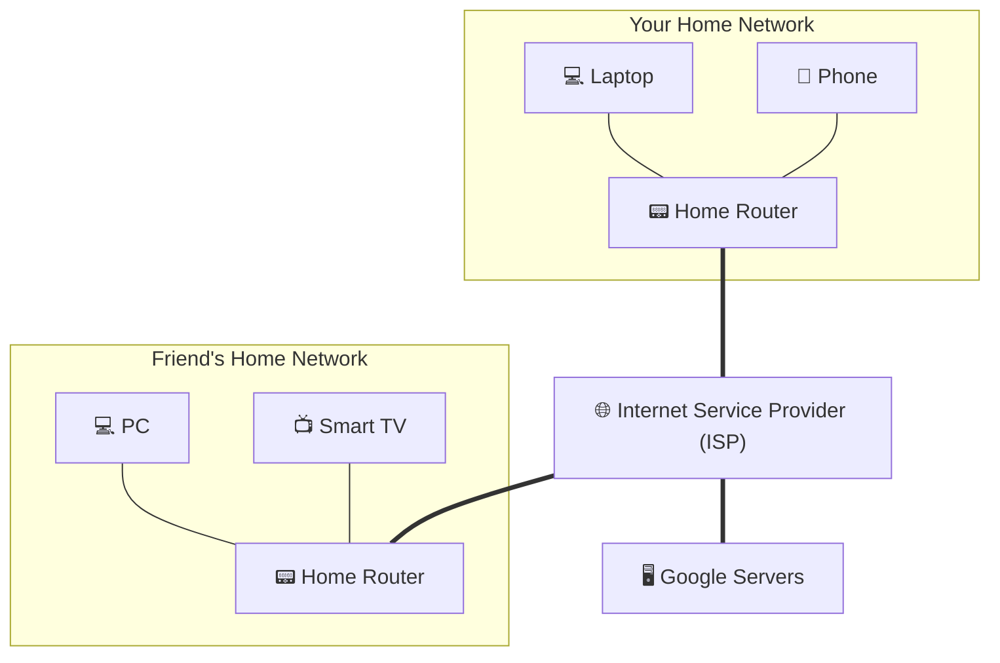
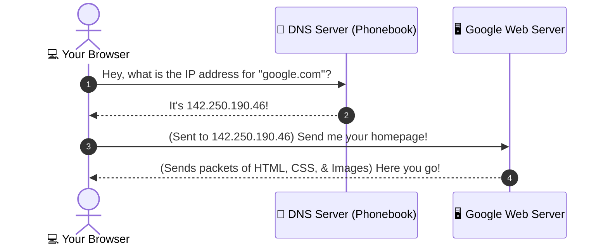

# How Does the Internet Work? (A Beginner's Guide)


## 1. What is the Internet?
### 🏠 The Neighbor Analogy
* **A Node / Device**: Imagine your computer, phone, or smart TV is a single house.
* **A Local Network (LAN)**: If you connect your computer, phone, and printer together in your home, you have a small neighborhood network. Your next-door neighbor has their own neighborhood network.
* **The Internet**: If we build roads and bridges to connect *every* neighborhood in the world together, we get a global network. 

> **The Internet is a "Network of Networks."** It is the physical and digital highway system that links billions of devices worldwide.



---

## 2. The Core Building Blocks

When you visit a website, your computer and the website's server are constantly talking to each other. Here are the key players in that conversation:

| Term | Real-World Analogy | What it Actually is |
| :--- | :--- | :--- |
| **Packet** | ✉️ A page of a letter in a separate envelope | A tiny chunk of data. Large files (like photos or videos) are chopped up into thousands of packets to travel easily. |
| **IP Address** | 📮 Your physical mailing address | A unique number assigned to every device connected to the internet (e.g., `192.168.1.1` or `142.250.190.46`). |
| **Domain Name** | 🏷️ "The White House" or "Google" | A human-readable name (like `google.com`) so you don't have to memorize IP address numbers. |
| **DNS (Domain Name System)** | 📖 The phone contact list or phonebook | A system that translates a domain name (like `youtube.com`) into its actual numerical IP address. |
| **Router** | 📯 A local postal sorting center | A specialized computer that reads the destination address on your data packets and directs them along the fastest route. |

---

## 3. The Journey of a Web Request
What actually happens when you type `https://google.com` into your browser and press Enter?



### The Steps Explained:
1. **The Lookup**: Your browser doesn't know where `google.com` is. It asks a **DNS Server** (the internet's phonebook) for the IP address.
2. **The Address**: The DNS server responds: *"Ah, google.com is located at `142.250.190.46`."*
3. **The Request**: Your browser sends a message across the internet saying: *"Hey `142.250.190.46`, send me your website files!"*
4. **The Delivery**: The Google server chops the website files into small **packets** and sends them back. Your home router receives them, your computer reassembles them, and your browser displays the beautiful webpage.

---

## 4. The Rules of the Road: Protocols
For computers to talk to each other, they must agree on a set of rules. In tech, these rules are called **Protocols**.

### ✉️ TCP/IP (Transmission Control Protocol / Internet Protocol)
This is the foundational language of the internet. It works in two parts:
* **IP (Internet Protocol)**: Addresses the envelope. It makes sure your packet has a "To" and "From" address so routers know where to send it.
* **TCP (Transmission Control Protocol)**: The delivery supervisor. If you send a digital book, TCP chops it into packets, numbers them (`1`, `2`, `3`), and sends them. On the receiving end, TCP makes sure all packets arrived, asks for replacements if any were lost, and puts them back in order.

> [!NOTE]
> **TCP vs. UDP**: 
> * **TCP** values accuracy over speed (used for webpages, emails, downloads).
> * **UDP** values speed over accuracy (used for live video streaming or online gaming, where losing a single packet/frame is okay, but lagging is not).

---

## 5. Web Browsing Protocols: HTTP vs. HTTPS

When your browser talks to a server, it uses **HTTP** (Hypertext Transfer Protocol).

* **HTTP (Unsecured)**: Messages are sent in plain text. If you type in a password, anyone sitting between you and the server (like someone sniffing Wi-Fi at a coffee shop) can read it.
* **HTTPS (Secured)**: The "S" stands for **Secure**. It encrypts (scrambles) the data before it leaves your computer. Even if someone intercepts it, it looks like gibberish.

```
HTTP (Plain Text):  MyPassword123  ---> [Internet] ---> Server reads: MyPassword123
HTTPS (Encrypted):  MyPassword123  ---> [Internet (Scrambled: &*#92@!kLm)] ---> Server decrypts: MyPassword123
```

---

## 6. How Secure Connections Work (SSL/TLS)
How do your browser and a server secure their communication? They use a process called **SSL/TLS** (Secure Sockets Layer / Transport Layer Security).

### 🤝 The Secret Handshake & The Safe box
Imagine you want to send a secret letter to a server:
1. **The Certificate**: The server shows you its **SSL Certificate** (like a digital passport verified by a trusted authority) to prove it is indeed the real Google, not an impostor.
2. **The Handshake**: Your browser and the server agree on a secret code/algorithm.
3. **The Lockbox**: Your browser puts the message in a digital lockbox, locks it with the agreed-upon code, and sends it. Only the server has the key to unlock it.

---

## 7. Connecting to Applications: Ports & Sockets
How does your computer know which app should receive which data? If you are browsing a webpage while listening to Spotify, why doesn't the website data go to Spotify?

* **Port**: Think of your computer's IP address as an apartment building. The **Ports** are the individual mailboxes or apartment numbers.
  * **Port 80**: Reserved for standard HTTP web traffic.
  * **Port 443**: Reserved for secure HTTPS web traffic.
  * **Port 25**: Reserved for Emails (SMTP).
* **Socket**: The combination of an IP address and a Port (e.g., `192.168.1.1:443`). It is the exact endpoint of a connection.

---

# Step-by-Step Overview: How the Internet Works

Based on the core principles of internet communication, here is the high-level, step-by-step process of how data travels across the internet from one device to another:

---

### Step 1: Connecting Devices
Devices (computers, phones, servers) connect to local networks, which are then connected to larger networks. These networks use a set of standardized rules called **protocols** to ensure they can all speak the same language.

### Step 2: Packetization (Breaking Down Data)
When you send data (like an image, email, or request for a website), it is too large to travel in one piece. Your device breaks this data down into small, manageable units called **packets**.

### Step 3: Addressing (IP Protocols)
Each packet is labeled with an **IP Address** for both its origin (source) and its destination (where it needs to go), similar to writing standard addresses on a physical envelope.

### Step 4: Routing (Hopping Between Routers)
The packets are sent from your device to your local router. 
* A global network of interconnected **routers** examines the destination address on each packet.
* Each router forwards the packet to the next closest router in the path toward its final destination.
* Packets do not all have to take the same path; they route dynamically based on network traffic.

### Step 5: Reliable Delivery & Reassembly (TCP Protocols)
Once all the packets arrive at the destination device:
* **TCP (Transmission Control Protocol)** checks if any packets were lost or corrupted along the way.
* If a packet is missing, TCP requests a retransmission.
* Once all packets arrive safely, TCP puts them back together in their original order.

### Step 6: Application Layer Processing (DNS, HTTP/S, SSL/TLS)
* **DNS** translates human-friendly domain names (like `google.com`) into numerical IP addresses.
* **HTTP/HTTPS** is the protocol used to exchange data between your browser (client) and the server.
* **SSL/TLS** encrypts the data during transit to ensure it is secure from interception.
