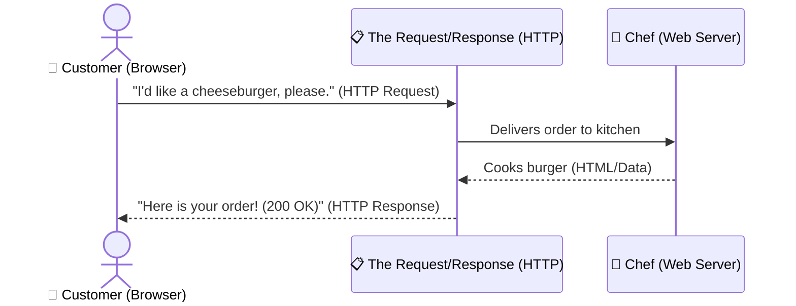

# Demystifying HTTP: The Restaurant Analogy

If you have ever clicked a link or typed a website address, you have used **HTTP (Hypertext Transfer Protocol)**. But what is it, really?

Let’s understand HTTP by imagining a visit to a restaurant.

---

## 1. What is HTTP?
At its core, HTTP is a messaging system. 
* **The Client (You/Your Browser)** is the customer sitting at the table.
* **The Server (The Website)** is the chef in the kitchen.
* **HTTP** is the waiter who carries your order (Request) to the kitchen and brings your food (Response) back.

---

## 2. What is in an HTTP Request?
When you want to view a page, your browser sends an **HTTP Request** (an order ticket) to the server. It contains:

| Part of Request | Restaurant Analogy | Technical Definition |
| :--- | :--- | :--- |
| **HTTP Method** | **"GET"** (Bring me food) vs. **"POST"** (Give the chef ingredients to cook) | The action you want to take (e.g., fetching a page vs. submitting a form). |
| **URL** | The name of the dish you are ordering (e.g., "Cheeseburger") | The address of the resource you want (e.g., `google.com/search`). |
| **Request Headers** | Special instructions (e.g., "Allergic to nuts", "Prefer English menus") | Metadata about your browser, preferred language, and security tokens. |
| **Request Body** | The customized toppings you hand to the chef | The actual data you are sending to the server (like typing in your password or profile picture). |

### Common HTTP Methods (Verbs)
* 📥 **GET**: Asking the server to send you something (like loading a blog post).
* 📤 **POST**: Submitting new information to the server (like entering your username and password to log in).

---

## 3. What is in an HTTP Response?
After the server processes your request, it sends back an **HTTP Response** (the delivery tray). It contains:

### 🚦 A Status Code
A 3-digit number telling you how your order went:

| Code Range | Category | Restaurant Analogy | Example Status Code |
| :--- | :--- | :--- | :--- |
| **1xx** | Informational | *"Hold on, the chef is preparing it."* | `100 Continue` |
| **2xx** | Success | *"Here is your food, enjoy!"* | `200 OK` (Webpage loaded perfectly) |
| **3xx** | Redirection | *"We moved that dish to our other location down the street."* | `301 Moved Permanently` |
| **4xx** | Client Error | *"You ordered something that isn't on our menu."* | `404 Not Found` (Typo in URL) |
| **5xx** | Server Error | *"The kitchen stove exploded! We can't cook your food."* | `500 Internal Server Error` |

### 📄 Response Headers
Details about the returned data (the recipe card), such as:
* What type of food it is (`Content-Type: text/html` or `Content-Type: image/png`).
* How large the dish is (`Content-Length: 1254` bytes).

### 🍔 Response Body
The actual content you requested. For a website, this is usually **HTML code**, which your web browser translates into the visual layout, images, and text you see on the screen.

---

> [!TIP]
> **What about HTTPS?**
> Standard HTTP sends your order open on the waiter's tray. Anyone walking by can see your password. 
> **HTTPS** puts your order inside a locked security box. Only you and the chef have the key. Always look for the **lock icon** in your browser's address bar!
