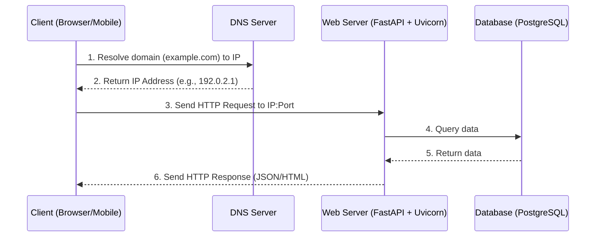
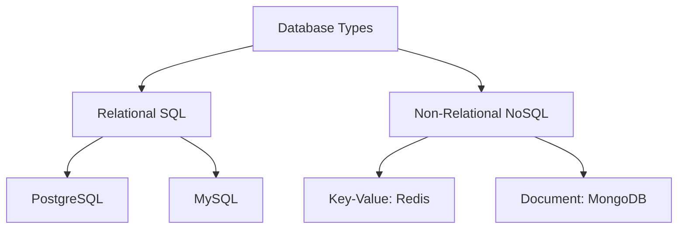
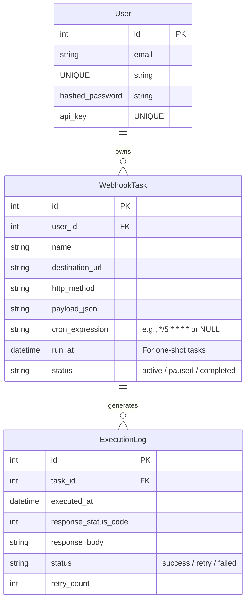

# Backend Development: Comprehensive Learning Syllabus & Architectural Guide

Welcome to the structured roadmap for backend engineering. This document serves as your reference guide, detailing the core concepts of backend engineering, a step-by-step FastAPI learning syllabus, and a detailed specification for your portfolio project, **Chronos**.

---

## 1. Core Backend Concepts: Detailed Explanation

### 1.1 Client-Server Architecture & Networking

At the heart of the web is the Client-Server model. Understanding how data travels between them is fundamental.



*   **The Client**: The frontend interface (e.g., browser, mobile app, or IoT device) that requests resources or submits data.
*   **The Server**: The backend machine running your code, waiting for requests, processing them, and returning a response.
*   **DNS (Domain Name System)**: The phonebook of the internet. It translates human-friendly domain names (like `google.com`) into computer-friendly IP addresses (like `142.250.190.46`).
*   **IP Addresses & Ports**:
    *   **IP Address**: Identifies a specific computer on the network (e.g., `192.168.1.1`).
    *   **Port**: A sub-address within that computer. Think of the IP address as an apartment building, and the Port as an individual apartment number. For example, web servers conventionally run on Port `80` (HTTP) or `443` (HTTPS). FastAPI dev servers run on `8000`.

---

### 1.2 The HTTP Protocol (Hypertext Transfer Protocol)

HTTP is the set of rules that clients and servers use to communicate. It is a **stateless** protocol, meaning each request is independent and knows nothing about previous requests.

#### HTTP Methods (Verbs)
Every HTTP request specifies an action. The most common are:

| Method | Purpose | Safe? | Idempotent? | Explanation |
| :--- | :--- | :--- | :--- | :--- |
| **GET** | Retrieve data | Yes | Yes | Asking the server for information. It must never change the server's state. |
| **POST** | Create data | No | No | Sending new data to the server (e.g., creating a user or submitting a form). |
| **PUT** | Replace data | No | Yes | Replacing an entire resource with new data. |
| **PATCH**| Modify data | No | No | Making partial updates to a resource (e.g., changing only a user's email). |
| **DELETE**| Remove data | No | Yes | Deleting a resource from the server. |

> [!NOTE]
> **Idempotent** means making the same request multiple times has the same outcome as making it once. For example, deleting an item twice still results in the item being deleted. Sending a POST request twice, however, will create two separate items.

#### HTTP Headers
Metadata sent alongside the request or response body. They control security, caching, and data formats.
*   `Content-Type`: Tells the receiver what format the payload is in (e.g., `application/json` or `text/html`).
*   `Authorization`: Carries credentials (like tokens) to prove who the client is.
*   `User-Agent`: Identifies the client software making the request (e.g., Chrome, Safari, or Python scripts).

#### HTTP Status Codes
The server's way of telling the client what happened. They are categorized by the first digit:

*   `1xx (Informational)`: Request received, continuing process.
*   `2xx (Success)`: The action was successfully received, understood, and accepted (e.g., `200 OK`, `201 Created`).
*   `3xx (Redirection)`: Further action needs to be taken to complete the request (e.g., `301 Moved Permanently`).
*   `4xx (Client Error)`: The request contains bad syntax or cannot be fulfilled (e.g., `400 Bad Request`, `401 Unauthorized`, `404 Not Found`).
*   `5xx (Server Error)`: The server failed to fulfill an apparently valid request (e.g., `500 Internal Server Error`, `503 Service Unavailable`).

---

### 1.3 Web Servers & Gateway Interfaces (WSGI vs ASGI)

Python web code cannot communicate directly with internet protocols. We use gateway interfaces as middleware.

```
[ Internet ] <---> [ Web Server: Uvicorn/Gunicorn ] <---> [ Gateway Interface: ASGI ] <---> [ Python App: FastAPI ]
```

*   **WSGI (Web Server Gateway Interface)**: The older standard (used by Django and Flask). It is **synchronous**. It handles requests one by one per process thread. If a request is waiting for a database query, that thread is blocked.
*   **ASGI (Asynchronous Server Gateway Interface)**: The modern standard (used by FastAPI). It supports **asynchronous** operations, WebSockets, and long polling. It allows Python to handle multiple concurrent connections on a single thread.
*   **Uvicorn**: An ASGI web server implementation. It listens on the network socket, receives byte strings, parses them into python-compatible dictionaries (specifically, an ASGI scope), and hands them to FastAPI.

---

### 1.4 Databases: Relational vs Non-Relational

Data persistence is critical. Choosing the right database model determines how you scale.



#### Relational Databases (SQL)
*   **How it works**: Data is structured into tables with fixed columns and rows. Tables relate to each other via keys (Primary Key / Foreign Key).
*   **ACID Guarantees**: Relational databases prioritize consistency:
    *   **Atomicity**: All operations in a transaction succeed, or all fail (no partial saves).
    *   **Consistency**: Databases must conform to schema rules (data types, unique constraints).
    *   **Isolation**: Transactions running concurrently don't interfere with each other.
    *   **Durability**: Once a transaction is committed, it remains saved even in a power outage.
*   **Tooling**: We use **ORMs** (Object-Relational Mappers) like SQLAlchemy or SQLModel to interact with database tables as Python classes. Schema changes over time are managed via **Alembic** migrations.

#### Non-Relational Databases (NoSQL)
*   **How it works**: Data is stored as key-value pairs, documents (JSON), graphs, or wide-columns. Schema constraints are relaxed for speed and ease of scaling.
*   **Redis**: An in-memory, key-value data structure store. It is extremely fast because data is kept in RAM rather than written to disk. In FastAPI, it is primarily used for **caching** (saving query results to serve them instantly next time) and **rate limiting**.

---

### 1.5 Security & Cryptography

Security is not an add-on; it must be built into the foundation of your API.

*   **Hashing vs. Encryption**:
    *   **Hashing**: A one-way function. You cannot reverse a hash back to its original value. We use hashing algorithms (like `bcrypt` or `argon2`) to store user passwords. When a user logs in, we hash their inputted password and compare it with the stored hash.
    *   **Encryption**: A two-way function. Data is scrambled using a key and can be decrypted back into plain text using the same (symmetric) or a different (asymmetric) key.
*   **Stateless Authentication (JWT)**:
    *   A JWT (JSON Web Token) consists of three parts: a Header (algorithm type), a Payload (user ID, expiration time), and a Signature.
    *   The backend signs the token using a secret key. The client stores this token and sends it in the `Authorization` header of every request. The server verifies the signature to trust the payload, avoiding a database lookup to authenticate the user on every request.

---

### 1.6 Asynchronous Programming in Python

Understanding `async` and `await` is essential for writing high-performance FastAPI applications.

```mermaid
sequenceDiagram
    autonumber
    actor User1 as User A
    actor User2 as User B
    participant Loop as Event Loop
    participant DB as Database

    User1->>Loop: Request Item Info
    Loop->>DB: Start Database Query (Async)
    Note over Loop: Event Loop yields control
    User2->>Loop: Request Home Page
    Loop-->>User2: Return Home Page (Instant)
    DB-->>Loop: Database Query Completes
    Loop-->>User1: Return Item Info
```

*   **Concurrency vs. Parallelism**:
    *   **Parallelism**: Doing multiple things at the exact same physical time (requires multiple CPU cores).
    *   **Concurrency**: Doing multiple tasks by switching between them rapidly (ideal for tasks spent waiting, like database queries or network requests).
*   **The Event Loop**: Python runs an event loop in a single thread. When your code encounters an `await` keyword, it hands control back to the event loop. The loop handles other tasks until the awaited operation (like a database query) resolves.

---

## 2. Fastapi Learning Syllabus

This curriculum is structured to build your knowledge incrementally. Do not skip phases.

### Phase 1: Python Asynchronous Programming & FastAPI Basics
*   **Goal**: Create routes, validate incoming data, and understand routing decorators.
*   **Key Concepts to Master**:
    *   `async def` vs `def`.
    *   Pydantic classes for request and response body shapes.
    *   Path, query, and header parameters.
    *   Status code returns and custom HTTP exception handling.
*   **Practice Exercise**: Build an API that takes a sentence, counts the word frequencies, and returns a structured JSON payload of the top 3 words.

### Phase 2: Relational Databases & Alembic Migrations
*   **Goal**: Integrate a persistent database layer.
*   **Key Concepts to Master**:
    *   Setting up SQLModel or SQLAlchemy models.
    *   Managing database sessions using FastAPI dependencies (`yield`).
    *   One-to-Many and Many-to-Many relationships.
    *   Database migrations with Alembic (creating, applying, and rolling back migrations).
*   **Practice Exercise**: Build a micro-blogging API where Users can write Posts, and each Post can have multiple Tags.

### Phase 3: Authentication, Authorization, & Security
*   **Goal**: Secure your API endpoints.
*   **Key Concepts to Master**:
    *   Password hashing with `passlib` and `bcrypt`.
    *   Creating, signing, and decoding JWT tokens.
    *   Creating a dependency to extract the current user from headers.
    *   CORS middleware configuration.
*   **Practice Exercise**: Protect your blog API so users can only edit or delete their own posts.

### Phase 4: Cache Systems & Background Jobs
*   **Goal**: Handle high traffic and heavy computation without blocking.
*   **Key Concepts to Master**:
    *   FastAPI's built-in `BackgroundTasks`.
    *   Using Redis to cache slow database read calls.
    *   Implementing a rate limiter using Redis to prevent API abuse.
*   **Practice Exercise**: Cache the "popular posts" endpoint for 60 seconds. Add a rate limit restricting users to 5 requests per minute.

### Phase 5: Containerization, Testing & Deployment
*   **Goal**: Build production-ready software.
*   **Key Concepts to Master**:
    *   Writing integration tests using `pytest` and `httpx.AsyncClient`.
    *   Creating a multi-stage `Dockerfile`.
    *   Using Docker Compose to run a web app, database, and Redis together.
    *   Deploying to a cloud platform.
*   **Practice Exercise**: Write tests to cover registration, login, and CRUD actions. Deploy the application to a cloud host.

---

## 3. Portfolio Project Spec: **Chronos**

This is the system design of your signature project. Build this step-by-step as you progress through the learning syllabus.

### 3.1 System Architecture

```
                 +-------------------+
                 |  Client / Browser |
                 +---------+---------+
                           |
            HTTP/JSON      |      WebSockets
      (Schedule & Manage)  |   (Real-time Logs)
                           v
                 +---------+---------+
                 |   FastAPI Server  |
                 +---+---------+-----+
                     |         |
      Read/Write     |         | Read/Write Cache
      Data Schema    |         | & Enqueue Tasks
                     v         v
         +-----------+-+     +-+-----------+
         | PostgreSQL  |     | Redis Cache |
         +-------------+     +------+------+
                                    |
                                    | Fetch Scheduled Jobs
                                    v
                             +------+------+
                             | arq Worker  | <---+ (Runs in background)
                             +------+------+
                                    |
                                    | Sends HTTP Request
                                    v
                             +------+------+
                             | Destination | (The target webhook URL)
                             +-------------+
```

### 3.2 Database Schema (SQLModel Design)

You will need three tables: `User`, `WebhookTask`, and `ExecutionLog`.



### 3.3 Core Code Implementation Paths

#### 1. Task Scheduling Logic
When a client schedules a webhook task to run once or repeatedly, the task is saved to PostgreSQL, and its job ID is added to **arq** (a Redis-based async task queue for Python).

#### 2. The Worker Loop
An independent python script (`worker.py`) runs in the background. It reads jobs scheduled in Redis. At the trigger time, it executes:
```python
import httpx
from datetime import datetime

async def execute_webhook(task_id: int, url: str, method: str, payload: dict, retry_count: int = 0):
    async with httpx.AsyncClient() as client:
        try:
            response = await client.request(method, url, json=payload, timeout=10.0)
            
            # Log successful execution in database
            await save_log(task_id, response.status_code, response.text, "success")
            
        except httpx.RequestError as exc:
            # Handle Network failure
            if retry_count < 3:
                # Re-schedule task in Redis with exponential backoff delay
                backoff_delay = (2 ** retry_count) * 60  # 1m, 2m, 4m
                await reschedule_task(task_id, backoff_delay, retry_count + 1)
                await save_log(task_id, 0, str(exc), "retry")
            else:
                await save_log(task_id, 0, str(exc), "failed")
```

#### 3. Real-time Event Streaming
When the worker writes an `ExecutionLog` entry to the database:
1. It publishes a JSON payload to a Redis Pub/Sub channel (e.g., `logs:user_1`).
2. FastAPI has an active WebSocket endpoint `/ws/logs` listening to the user's Channel.
3. FastAPI receives the log event from Redis and instantly sends it to the frontend browser interface.
